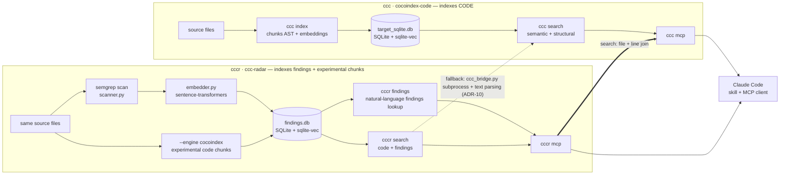

# ccc-radar (`cccr`)

Natural-language-queryable Semgrep findings index, combined with [cocoindex-code](https://github.com/cocoindex-io/cocoindex-code) (`ccc`).

`cccr` locally indexes a project's Semgrep findings (in a SQLite database
`.cccr/findings.db`), makes them queryable in natural language (embedding-based
search), and joins them with `ccc` code search results at query time.

The chosen positioning is intentionally **two-layered**:

- **Core product**: Semgrep findings index for agents and developers
  (`init`, `index`, `findings`, `summary`, `search`, MCP `search_findings` /
  `findings_summary` / `search` / `reindex_findings`).
- **Java/Spring microservices audit extension**: REST/Kafka inventory,
  inter-service graph, and flow tracing (`endpoints`, `graph`, `workspace`,
  `flow`, `.drawio` export) built on top of the same index, but to be treated
  as a microservices-focused extension still being stabilized.

## Architecture — how `cccr` extends `ccc`

`cccr` is a **companion package**, not a fork: it imports none of `ccc`'s
internal code (ADR-1). The stable engine indexes findings separately and joins
them with `ccc` results at query time. An experimental engine,
`cccr index --engine cocoindex`, prepares a more native extension: it adds a
local code chunk index in the same SQLite store (`sqlite-vec`) so that
`cccr search` can avoid text parsing of `ccc search` when that index is
available (ADR-21).



Key points:

- **No coupling to `ccc` internal code** — the stable engine always uses the
  `ccc` binary as a subprocess; the experimental engine adds a local chunk
  index to reduce that dependency without importing any `cocoindex-code`
  internal API.
- **Two indexes, one storage technology** — each keeps its own SQLite file
  (`target_sqlite.db` for code chunks, `findings.db` for findings), but both
  use `sqlite-vec`/`vec0` for vector search (ADR-17), and the same default
  embedding model (`~/models/jina-code-embeddings-1.5b`, ADR-3).
- **The join can use the local experimental index** — with `--engine cocoindex`,
  the MCP `search` tool queries local chunks first and then joins findings by
  file + lines; otherwise it keeps the `ccc search` fallback.
- **The agent (Claude Code) is the convergence point** — through the two MCP
  servers (`ccc mcp`, `cccr mcp`) and the skill, which orchestrates code
  search, findings search, and the remediation loop.

## Documentation

- [`AGENT.md`](AGENT.md) — for any agent contributing to this repo: document map and documentation maintenance rules.
- [`docs/PRD.md`](docs/PRD.md) — product: problem, vision, personas, use cases, success metrics.
- [`docs/SPEC-FONC.md`](docs/SPEC-FONC.md) — functional specification: CLI commands, MCP tools, skill, error behaviors.
- [`docs/SPEC-TECH.md`](docs/SPEC-TECH.md) — technical specification: modules, data model, SQLite schema, algorithms.
- [`docs/ADR.md`](docs/ADR.md) — architecture decisions (context, choice, consequences).
- [`reports/README.md`](reports/README.md) — example reports generated from the repositories under `~/examples`.
The Claude Code skill (`SKILL.md`) is distributed separately from this repo, in
[`ccc-radar-skill`](https://github.com/elkouhen/ccc-radar-skill); its
functional behavior remains documented in
[`docs/SPEC-FONC.md`](docs/SPEC-FONC.md).

## Related projects

- [`cocoindex-code`](https://github.com/cocoindex-io/cocoindex-code) (`ccc`)
  — the semantic code indexing and search tool that `cccr` complements (see
  “Architecture” above). `cccr` does not fork this project and imports none of
  its internal modules (ADR-1); it calls it as a subprocess and reuses its
  storage technology (`sqlite-vec`).
- [`ccc-radar-skill`](https://github.com/elkouhen/ccc-radar-skill) —
  the Claude Code skill that orchestrates `ccc`/`cccr` from the agent (see
  above).

## Installation

```bash
uv tool install ccc-radar
uv tool install cocoindex-code
pipx install semgrep
env -u SSL_CERT_FILE uvx --from huggingface_hub hf download jinaai/jina-code-embeddings-1.5b --local-dir ~/models/jina-code-embeddings-1.5b
```

The default `embedding_model` points to `~/models/jina-code-embeddings-1.5b`.
When downloading via `hf`, removing `SSL_CERT_FILE` from the environment avoids
TLS failures observed on some workstations.

## Upgrade

```bash
uv tool upgrade ccc-radar   # upgrades cccr only
uv tool upgrade --all       # upgrades all tools installed via uv (including cocoindex-code)
```

## Getting started

### Core product

```bash
cccr init                       # detects a Semgrep config, otherwise copies the skill packs then falls back to p/security-audit
cccr index                      # incremental scan + progress + embeddings
ccc index                       # required for cccr search fallback unless you use --engine cocoindex
cccr search "user auth flow"    # code search (via ccc) + findings that overlap it
cccr findings "sql injection"   # natural-language lookup in findings (hybrid semantic + exact keyword/rule/CWE matches)
cccr summary                    # aggregated view (severities, top rules, top directories)
```

The `p/security-audit` fallback is enough for the **core product** (findings).
For the microservices extension, `cccr init` must be able to copy the skill
packs (`default`, `liveness`, `rest`, `kafka`, `kafka-security`); otherwise
`cccr endpoints` / `graph` / `flow` have no usable inventory.
During `cccr index`, the CLI prints stage progress (file inventory, delta,
Semgrep scan, persistence, embedding) before the final
`scanned=... skipped=... +findings=...` summary line.

### Java/Spring microservices extension

```bash
cccr index --engine cocoindex   # experimental: adds a local code chunk index
cccr endpoints                  # indexed REST/Kafka inventory
cccr graph                      # inter-service REST/Kafka topology
cccr microservices              # discovery of indexed Maven/Gradle services from current dir
cccr flow "orders.created"      # producers/consumers or callers/servers for a flow
```

For a **Java microservices audit** driven by the `ccc-radar-skill` skill,
`cccr init` first tries to copy these packs from the skill repo into
`.cccr/rules/`, then enables them in `rules:`. The audit workflow then remains
`cccr summary` → `cccr endpoints` → `cccr graph` → `cccr findings` /
`cccr search`.

`cccr search` is a **superset of `ccc search`**: same options (`--limit`,
`--offset`, `--lang`, `--path`, `--refresh`), same results, same format, each
result enriched with overlapping Semgrep findings and ranked while taking their
severity into account. On the MCP side, the tool has the same name as `ccc`'s
(`search`) and takes the same parameters. When `cccr` falls back to the `ccc`
bridge, a ready `ccc` index (`.cocoindex_code/target_sqlite.db`, usually built
via `ccc index`) must already exist; otherwise `cccr search` now fails
immediately with an explicit message instead of hanging until the MCP request
times out.

Example with explicit rules and a full scan:

```bash
cccr init --rules rules/rules.yml
cccr index --full
cccr findings "sql injection" --severity ERROR --path "app/*" --limit 5 --context
cccr search "user auth flow" --json
```

## Development (in this repo)

```bash
uv sync
uv run cccr version
uv run pytest
```

## MCP server

`cccr` exposes an MCP server (stdio) via `cccr mcp`.

- **Core product**: `search_findings`, `findings_summary`, `search`
  (same name and parameters as `ccc`'s `search`), and `reindex_findings`.
- **Java/Spring microservices extension**: `list_endpoints`, `graph`,
  `list_workspace_services`, `trace_message_flow`.

Client registration (e.g. Claude Code):

```json
{"mcpServers": {"cccr": {"command": "cccr", "args": ["mcp"]}}}
```

For the post-patch freshness check of a specific file (remediation loop, see
[`ccc-radar-skill`](https://github.com/elkouhen/ccc-radar-skill)), also
register the official Semgrep MCP server:

```json
{"mcpServers": {"semgrep": {"command": "uvx", "args": ["semgrep-mcp"]}}}
```

For `.cccr/config.yml` configuration field details, see
[`docs/SPEC-FONC.md`](docs/SPEC-FONC.md).

## License

[Apache License 2.0](LICENSE), like the upstream
[`cocoindex-code`](https://github.com/cocoindex-io/cocoindex-code) project.
