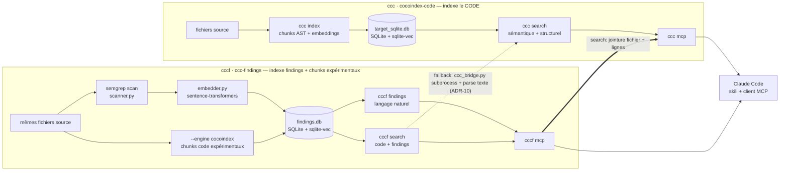

# ccc-findings (`cccf`)

Index Semgrep interrogeable en langage naturel, combiné à [cocoindex-code](https://github.com/cocoindex-io/cocoindex-code) (`ccc`).

`cccf` indexe localement les findings Semgrep d'un projet (dans une base
SQLite `.cccf/findings.db`), les rend interrogeables en langage naturel
(recherche par embeddings) et les joint aux résultats de recherche de code
de `ccc` à la requête.

## Architecture — comment `cccf` étend `ccc`

`cccf` est un **package compagnon**, pas un fork : aucun import du code
interne de `ccc` (ADR-1). Le moteur stable indexe les findings séparément et
les joint aux résultats `ccc` à la requête. Un moteur expérimental
`cccf index --engine cocoindex` prépare une extension plus native : il ajoute
un index local de chunks de code dans le même store SQLite (`sqlite-vec`) pour
que `cccf search` puisse éviter le parsing texte de `ccc search` quand cet
index est disponible (ADR-21).



Points clés :

- **Pas de couplage de code interne à `ccc`** — le moteur stable utilise
  toujours le binaire `ccc` en subprocess ; le moteur expérimental ajoute un
  index local de chunks pour réduire cette dépendance sans importer d'API
  interne de `cocoindex-code`.
- **Deux index, une seule techno de stockage** — chacun garde son propre
  fichier SQLite (`target_sqlite.db` pour les chunks de code, `findings.db`
  pour les findings), mais tous deux via `sqlite-vec`/`vec0` pour la
  recherche vectorielle (ADR-17), et le même modèle d'embedding par défaut
  (`Snowflake/snowflake-arctic-embed-xs`, ADR-3).
- **La jointure peut utiliser l'index local expérimental** — avec
  `--engine cocoindex`, le tool MCP `search` interroge les chunks locaux
  puis joint les findings par fichier + lignes ; sinon il garde le fallback
  `ccc search`.
- **L'agent (Claude Code) est le point de convergence** — via les deux
  serveurs MCP (`ccc mcp`, `cccf mcp`) et le skill, qui orchestre recherche de
  code, recherche de findings et boucle de correction.

## Documentation

- [`AGENT.md`](AGENT.md) — pour tout agent contribuant à ce repo : carte des documents et règle « tout changement se documente dans un BACKLOG ».
- [`docs/PRD.md`](docs/PRD.md) — produit : problème, vision, personas, cas d'usage, métriques de succès.
- [`docs/SPEC-FONC.md`](docs/SPEC-FONC.md) — spécification fonctionnelle : commandes CLI, tools MCP, skill, comportements d'erreur.
- [`docs/SPEC-TECH.md`](docs/SPEC-TECH.md) — spécification technique : modules, modèle de données, schéma SQLite, algorithmes.
- [`docs/ADR.md`](docs/ADR.md) — décisions d'architecture (contexte, choix, conséquences).
- `archive/` — historique du plan d'implémentation (`BACKLOG.md`) et des findings de revue de code (`BACKLOG-2.md`).

Le skill Claude Code (`SKILL.md`) est distribué séparément de ce repo, dans
[`ccc-findings-skill`](https://github.com/elkouhen/ccc-findings-skill) ; son
comportement fonctionnel reste documenté dans
[`docs/SPEC-FONC.md`](docs/SPEC-FONC.md#4-skill-claude-code).

## Projets liés

- [`cocoindex-code`](https://github.com/cocoindex-io/cocoindex-code) (`ccc`)
  — l'outil d'indexation et de recherche de code sémantique dont `cccf` est
  le compagnon (voir « Architecture » ci-dessus). `cccf` ne fork pas ce
  projet et n'importe aucun de ses modules internes (ADR-1) ; il l'appelle
  en subprocess et réutilise sa techno de stockage (`sqlite-vec`).
- [`ccc-findings-skill`](https://github.com/elkouhen/ccc-findings-skill) —
  le skill Claude Code qui orchestre `ccc`/`cccf` depuis l'agent (voir
  ci-dessus).

## Installation

```bash
uv tool install ccc-findings
pipx install semgrep
```

## Démarrage

```bash
cccf init                       # détecte une config Semgrep, sinon utilise p/security-audit
cccf index                      # scan Semgrep incrémental + embeddings
cccf index --engine cocoindex   # expérimental : ajoute un index local de chunks code
cccf search "user auth flow"    # recherche de code (via ccc) + findings qui la recouvrent
cccf findings "injection sql"   # recherche en langage naturel dans les findings seuls
cccf summary                    # vue agrégée (sévérités, top règles, top répertoires)
```

`cccf search` est un **sur-ensemble de `ccc search`** : mêmes options
(`--limit`, `--offset`, `--lang`, `--path`, `--refresh`), mêmes résultats,
même format, chaque résultat enrichi des findings Semgrep qui le recouvrent
et classé en tenant compte de leur sévérité. Côté MCP, le tool porte le même
nom que celui de `ccc` (`search`) et prend les mêmes paramètres.

Exemple avec des règles explicites et un scan complet :

```bash
cccf init --rules rules/rules.yml
cccf index --full
cccf findings "injection sql" --severity ERROR --path "app/*" --limit 5 --context
cccf search "user auth flow" --json
```

## Développement (dans ce repo)

```bash
uv sync
uv run cccf version
uv run pytest
```

## Serveur MCP

`cccf` expose un serveur MCP (stdio) via `cccf mcp`, avec les tools
`search_findings`, `findings_summary`, `search` (mêmes nom et paramètres que
le `search` de `ccc`) et `reindex_findings`. Enregistrement client (ex. Claude
Code) :

```json
{"mcpServers": {"cccf": {"command": "cccf", "args": ["mcp"]}}}
```

Pour la vérification fraîche post-patch d'un fichier précis (boucle de
correction, voir le skill [`ccc-findings-skill`](https://github.com/elkouhen/ccc-findings-skill)),
enregistrer en complément le MCP Semgrep officiel :

```json
{"mcpServers": {"semgrep": {"command": "uvx", "args": ["semgrep-mcp"]}}}
```

Détail des champs de configuration `.cccf/config.yml` : voir
[`docs/SPEC-FONC.md`](docs/SPEC-FONC.md#1-configuration-du-projet).

## Licence

[Apache License 2.0](LICENSE), comme le projet amont
[`cocoindex-code`](https://github.com/cocoindex-io/cocoindex-code).
