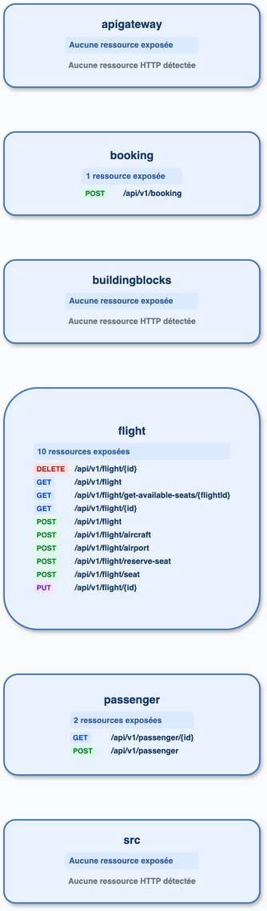

# booking-microservices-java-spring-boot

## Exécution

`cccr index` : 16 endpoints; graphe sans arête. La découverte fédérée retourne `src`, `apigateway`, `buildingblocks`, `booking`, `flight`, `passenger`.

## Analyse directe

Les contrôleurs de production sont dans les artefacts `booking`, `flight` et `passenger`; `buildingblocks` est une bibliothèque commune et `src` un conteneur de sources. Des configurations `RestTemplate` et des usages Kafka existent, mais les appels métier inter-services ne sont pas résolus en relations statiques par l’inventaire actuel.

## Diff

| Élément | cccr | Direct | Écart |
|---|---|---|---|
| Services | 6, dont `src` et `buildingblocks` | booking, flight, passenger (et gateway si déployé) | faux positifs de découverte de service |
| HTTP exposé | 13 routes de production + appels dynamiques de test | mêmes contrôleurs | routes conformes; appels test à isoler |
| Kafka | topic dynamique non résolu | usages médiateur/Kafka présents | résolution de configuration manquante |
| Arêtes | 0 | relations non triviales/configurées | faux négatifs attendus |

## Axes

Priorité P0 : ne retenir qu’un module applicatif Maven/Gradle déployable, identifié par son artifact, et exclure les agrégateurs/bibliothèques.
