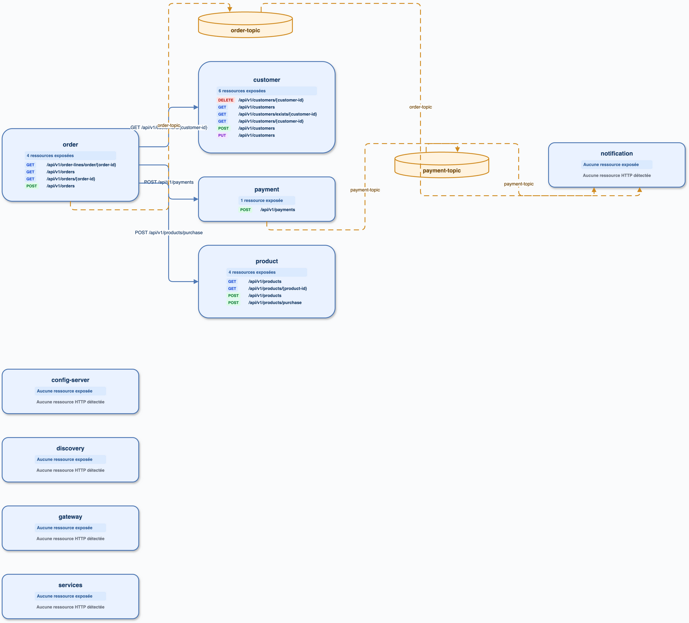

# fully-completed-microservices-Java-Springboot

## Exécution

`cccr index` : 22 endpoints. Le graphe contient 9 services nommés, 2 topics Kafka et 5 connecteurs visualisés.

## Analyse directe

Les artefacts applicatifs sont `customer`, `order`, `payment`, `product`, `notification`, `gateway`, `discovery` et `config-server`. `order` appelle Customer/Payment/Product; Order et Payment publient respectivement sur `order-topic` et `payment-topic`, consommés par Notification.

## Diff

| Élément | cccr | Direct | Écart |
|---|---|---|---|
| Services | 9, dont `services` | 8 applicatifs | `services` est un faux service conteneur |
| HTTP | 3 appels Order vers Customer/Payment/Product | mêmes appels | conforme |
| Kafka | 2 producteurs + 2 consommateurs, 2 topics | mêmes flux | conforme |
| Arêtes | 5 connecteurs Draw.io groupés | 7 relations détaillées | groupement visuel attendu |

## Axes

Priorité P0 : ne jamais promouvoir un répertoire parent (`services`) en microservice; le nom doit rester l’artifact Maven/Gradle.
