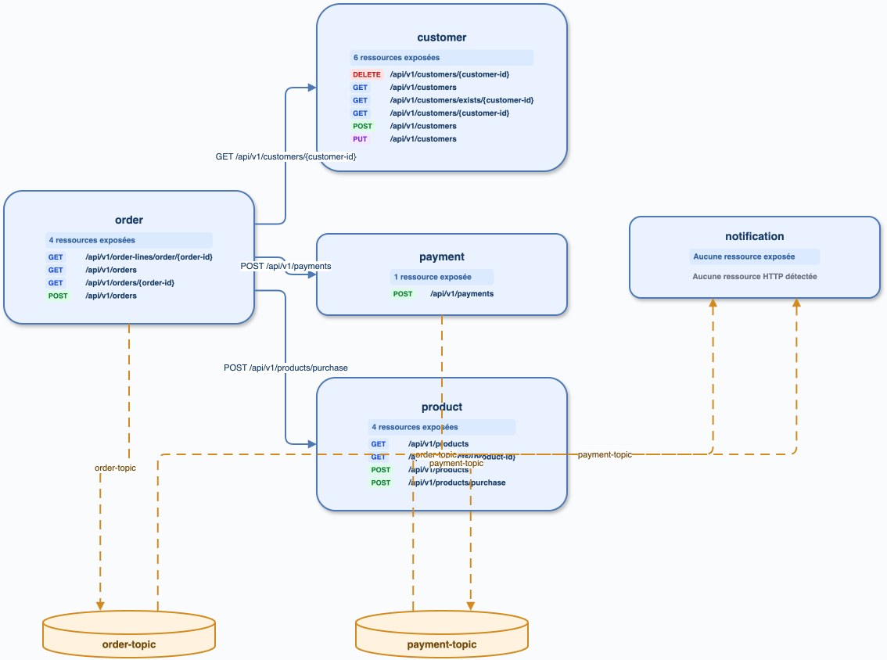

# Audit — fully-completed-microservices-Java-Springboot

Préflight : `main` / `4a3d1d7`, état local préservé. Index v6 migré exclusivement en copie temporaire ; packs actifs mais modèle absent. Semgrep 1.169.0, `cccr` 0.1.0.

Analyse directe : 18 routes REST ; clients déclaratifs Customer/Payment, producteurs `order-topic` et `payment-topic`, deux listeners Notification. Les routes et topics littéraux sont résolus.

| Inventaire | REST | Kafka | Graphe |
| --- | ---: | ---: | --- |
| cccr historique | 18 | 4 | 5 services, 5 arêtes |
| direct | 18 | 4 | deux flux Kafka résolus |

L'avertissement de fraîcheur rend toute différence résiduelle non attribuable avant réindexation. Sources : `/private/tmp/ccc-radar-audit/fully-completed-microservices-Java-Springboot-endpoints.json`.

## Kafka et Mongo — rapprochement détaillé

| Usage Kafka direct (production) | Preuve | `cccr` réindexé |
| --- | --- | --- |
| produce `order-topic` | `services/order/.../OrderProducer.java:26` (`KafkaTemplate.send`) | producer présent |
| consume `order-topic` | `services/notification/.../NotificationsConsumer.java:46` | consumer présent |
| produce `payment-topic` | `services/payment/.../NotificationProducer.java:26` | producer présent |
| consume `payment-topic` | `services/notification/.../NotificationsConsumer.java:27` | consumer présent |

Ces quatre endpoints sont présents dans les deux inventaires et forment les deux relations Kafka résolues vers Notification. Mongo est aussi confirmé directement : `Customer.java:17` et `Notification.java:21` portent `@Document` (nom de collection implicite), les repositories sont `MongoRepository`, et les opérations `save`, `findById`, `findAll` apparaissent notamment dans `CustomerService.java:19–58`, `OrderService.java:40,75,82` et les consumers Notification. Les collections implicites ne sont pas encore matérialisées par `cccr` (le résultat `modules` est vide) : faux négatif P1 de l’inventaire Mongo, sans incidence sur le graphe HTTP/Kafka.

