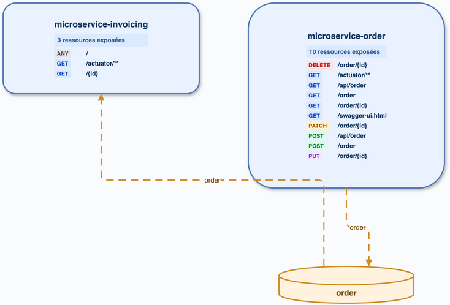

# microservices-kafka-mq

## Exécution

`cccr index` : 15 endpoints; le graphe fédéré détecte 2 services et une relation Kafka inter-service.

## Analyse directe

Lecture de `microservice-order` et `microservice-invoicing` : `OrderService` publie sur `order`, et `OrderKafkaListener` consomme ce topic. Les occurrences supplémentaires dans `src/test` sont des tests Kafka/REST et ne doivent pas être confondues avec l’architecture de production.

## Diff

| Élément | cccr | Direct | Conclusion |
|---|---|---|---|
| Services | order, invoicing | order, invoicing | conforme |
| Topic production | order | order | conforme |
| Consommation | invoicing | invoicing | conforme |
| Tests | sites détectés si indexés | tests présents | à filtrer/étiqueter |

## Axes

Voir P2 « exclusion/étiquetage test » dans [BACKLOG.md](../BACKLOG.md).
