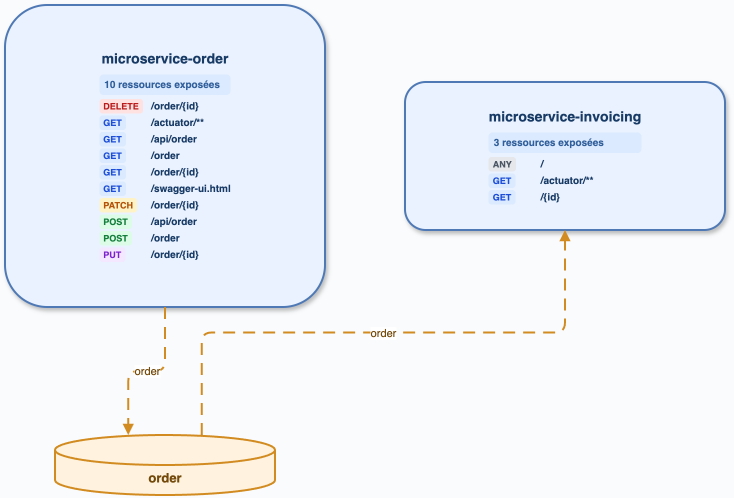
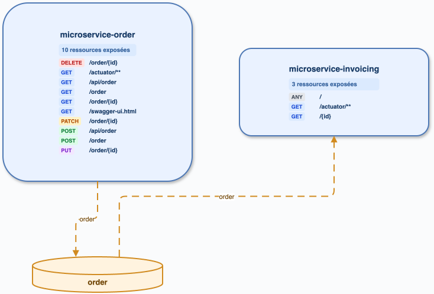

# Audit — microservices-kafka-mq

Préflight : `master` / `5a597e2b`, état local préservé. Index v11 et packs actifs ; modèle d'embeddings absent (avertissement). Semgrep 1.169.0, `cccr` 0.1.0.

Analyse directe de production : serveur `/api/order`, serveur Invoice, `KafkaTemplate.send("order", ...)` et `@KafkaListener(topics="order")`. Le listener de test est exclu.

| Inventaire | REST | Kafka | Graphe |
| --- | ---: | ---: | --- |
| cccr historique | 13 | 2 | 2 services, 1 arête |
| direct | 13 | 2 | `order` producteur → consommateur |

Diff confirmé : aucun dans le périmètre ; conserver l'exclusion des tests (P2). Sources : `/private/tmp/ccc-radar-audit/microservices-kafka-mq-endpoints.json`.

## Kafka et Mongo — rapprochement détaillé

| Usage Kafka direct (production) | Preuve | `cccr` réindexé |
| --- | --- | --- |
| produce `order` | `microservice-order/.../OrderService.java:39–40`, `KafkaTemplate.send` | producer `spring-kafka` présent |
| consume `order` | `microservice-invoicing/.../OrderKafkaListener.java:23` | consumer `spring-kafka` présent |

La relation `microservice-order → order → microservice-invoicing` est résolue. Le listener de test n’entre pas dans l’inventaire de production. Les opérations `findById`, `findAll` et `save` observées dans les deux modules reposent sur JPA ; aucun `@Document`, `MongoRepository` ou `MongoTemplate` de production n’est présent. Il n’y a donc pas d’écart Mongo à attribuer à `cccr`.

