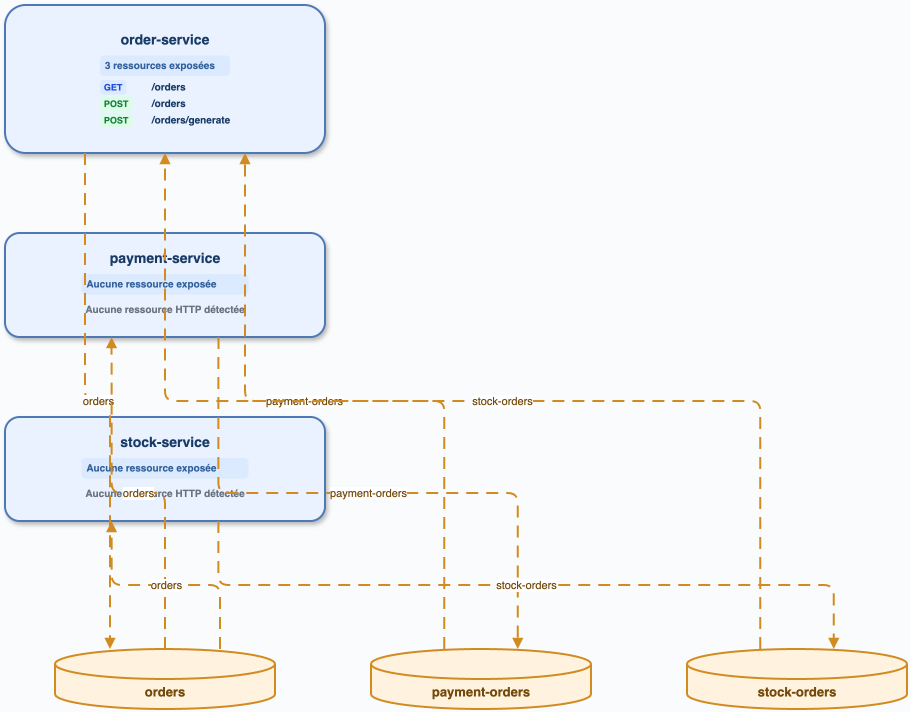

# Audit — sample-spring-kafka-microservices

Préflight : `master` / `4e1ed6b`, état local préservé. Index v11 et packs actifs ; le modèle d'embeddings est absent (avertissement), donc aucune réindexation n'a été lancée. Semgrep 1.169.0, `cccr` 0.1.0.

Analyse directe : 3 routes HTTP `POST/GET /orders*`; Kafka observe deux listeners `orders`, trois `KafkaTemplate.send` et Kafka Streams (`stream`/`to`) sur `orders`, `payment-orders`, `stock-orders`. Aucun signal de test n'est compté.

| Inventaire | REST | Kafka | Graphe |
| --- | ---: | ---: | --- |
| cccr historique | 3 | 10 | 3 services, 8 arêtes |
| direct | 3 | 10 | producteurs/consommateurs par topic |

Diff confirmé : couverture Kafka Streams à protéger par fixture e2e (P1). Sources brutes : `/private/tmp/ccc-radar-audit/sample-spring-kafka-microservices-endpoints.json`.

## Kafka et Mongo — rapprochement détaillé

| Usage Kafka direct (production) | Preuve | `cccr` réindexé |
| --- | --- | --- |
| consume `orders` | `PaymentApp.java:30`, `StockApp.java:29` (`@KafkaListener`) | les deux consumers `spring-kafka` sont présents |
| produce `orders` | `OrderController.java:40`, `OrderGeneratorService.java:32` (`KafkaTemplate.send`) | les deux producers sont présents |
| produce `payment-orders` / `stock-orders` | `payment/.../OrderManageService.java:36`, `stock/.../OrderManageService.java:36` | présents |
| Streams consume `payment-orders`, `stock-orders`, puis produce `orders` | `order-service/.../OrderApp.java:71–80` (`builder.stream`, `.to`) | présents comme `kafka-streams` |

Les 10 endpoints Kafka réindexés recouvrent donc les usages directs (mêmes topics, rôles et modules) ; les producteurs et consommateurs de `orders` forment des relations résolues, sans déduire une relation au-delà de l’égalité de topic. Les appels `save`/`findById` de Payment et Stock sont des repositories JPA : aucune collection Mongo (`@Document`, `MongoRepository`, `MongoTemplate`) n’est observée. Mongo est absent des deux inventaires, conformément au code.

