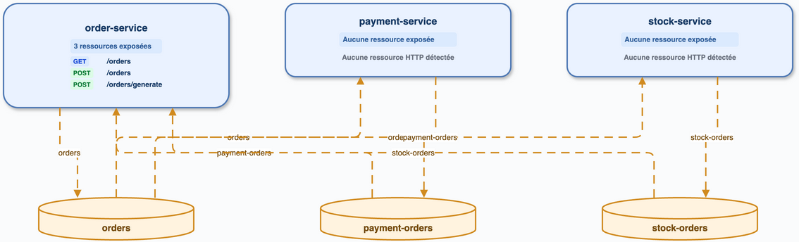

# sample-spring-kafka-microservices

## Exécution

`cccr index` : 13 endpoints. Le graphe contient 3 services, 3 topics et 8 segments Kafka visualisés après déduplication des producteurs identiques.

## Analyse directe

Lecture de `OrderApp`, `PaymentApp`, `StockApp` et des services utilisant `KafkaTemplate`. Le flux principal est `order-service → orders → {payment-service, stock-service}`, suivi des topics `payment-orders` et `stock-orders` consommés par `order-service`.

## Diff

| Élément | cccr | Direct | Conclusion |
|---|---|---|---|
| Services | 3 | 3 | conforme |
| Topics | orders, payment-orders, stock-orders | mêmes topics | conforme |
| Kafka | producteurs/consommateurs détectés | mêmes flux principaux | conforme, doublons de sites producteurs regroupés visuellement |
| HTTP | contrôleur Order | contrôleur Order | conforme |

## Axes

Le layout Kafka en deux bandes a été appliqué : services au-dessus, topics en dessous. Voir P2 dans le backlog pour la distinction future des appels de test.
