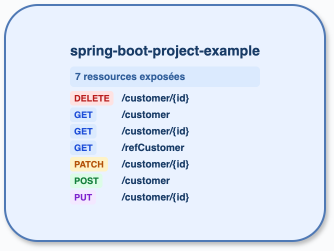

# Audit — spring-boot-project-example

Commit analysé : `91e0d5ed5996ce5de0286605ac539c5c984dc960` (`main`, seul état non suivi : `.cccr/`). Préflight : `cccr` 0.1.0, les cinq packs actifs et `cccr doctor --json` vert. Semgrep autonome ne peut pas écrire son journal global dans ce sandbox ; l'index `cccr` utilise son journal privé et a réussi (47 fichiers, 1 finding, 7 endpoints). Sorties brutes : [`reports/raw`](raw/) (`spring-boot-project-example-*.json`).

L'analyse directe a précédé la lecture de ces sorties et exclut `src/test`. Elle confirme un module Maven Spring Boot, aucun client HTTP ou Kafka, et deux repositories Mongo.

| Inventaire | Services | HTTP servis | Kafka | Mongo collections | Mongo opérations | Arêtes |
| --- | ---: | ---: | ---: | ---: | ---: | ---: |
| `cccr` | 1 | 7 | 0 | 2 | 0 | 0 |
| lecture directe | 1 | 7 | 0 | 2 | 6 | 0 |

## Diff structuré

| Catégorie | Présents dans les deux | Seulement `cccr` | Seulement direct / cause |
| --- | --- | --- | --- |
| Service/module | `spring-boot-project-example` — Maven/Spring Boot | — | — |
| HTTP | `POST /customer:48`, `GET /customer:69`, `GET /customer/{id}:95`, `PATCH /customer/{id}:122`, `PUT /customer/{id}:145`, `DELETE /customer/{id}:167`, `GET /refCustomer:45` | — | — |
| Kafka et usage | aucun listener, poll/subscribe, producer, Streams ou Cloud Stream | — | — |
| Collections Mongo | `customer` (`CustomerEntity.java:22`), `apiLog` (`ApiLogEntity.java:17`) | — | — |
| Opérations Mongo | — | — | `customerRepository.findAll:61`, `findById:76,96,122`, `save:141`; `apiLogRepository.save:96`. L'extracteur ne relie pas encore les receivers de repository aux opérations. |
| Arêtes | aucune : aucune cible HTTP ni topic Kafka résolu | — | — |

Note `cccr` : **4/5**. La couverture service/HTTP/Kafka/graph est complète et toutes les routes ont une preuve locale. La seule perte confirmée est l'inventaire détaillé des opérations Mongo ; elle est déjà dédoublonnée dans le backlog P2 (« Rapprocher les opérations Mongo des repositories injectés »). Aucun protocole hors périmètre n'est observé.

