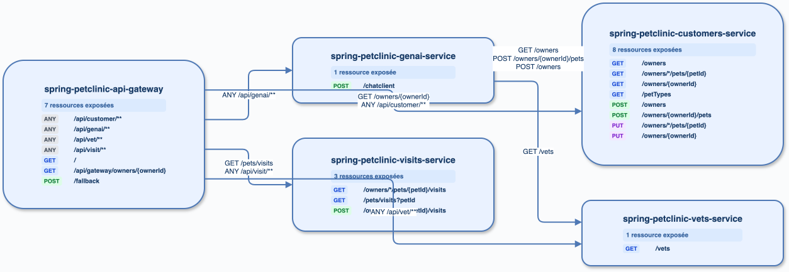

# Audit — spring-petclinic-microservices

Préflight : `main` / `305a1f1`, état local non propre préservé. Index v11 présent ; `cccr doctor` refuse l'indexation car les packs architecture ne sont pas actifs. Semgrep 1.169.0, `cccr` 0.1.0.

Analyse directe (production) : 20 routes Spring servies et 10 appels REST dans la gateway ; aucun Kafka. Les préfixes `@RequestMapping` sont fusionnés (par exemple `GET /owners/{ownerId}`). Les routes Gateway générales/dynamiques restent non résolues.

| Inventaire | REST | Kafka | Graphe |
| --- | ---: | ---: | --- |
| cccr historique | 30 | 0 | 5 services, 10 arêtes |
| direct | 30 | 0 | appels Gateway dynamiques non reliés |

Les écarts confirmés sont les libellés insuffisants des routes Gateway génériques ; ils restent P1 dans `BACKLOG.md`. Sources brutes : `/private/tmp/ccc-radar-audit/spring-petclinic-microservices-endpoints.json`.

## Kafka et Mongo — rapprochement détaillé

Aucun usage Kafka de production (`@KafkaListener`, `KafkaTemplate`, `ProducerRecord`, client natif, Streams ou Cloud Stream) n’est observé et `cccr` n’en inventorie aucun. Les appels `findById`, `findAll` et `save` relevés dans Customers, Vets et Visits sont des repositories JPA ; aucune preuve locale de `@Document`, `MongoRepository` ou `MongoTemplate` ne permet de les classer Mongo. Les deux inventaires Mongo/Kafka sont donc vides par preuve, et l’absence d’arête Kafka est conforme.

