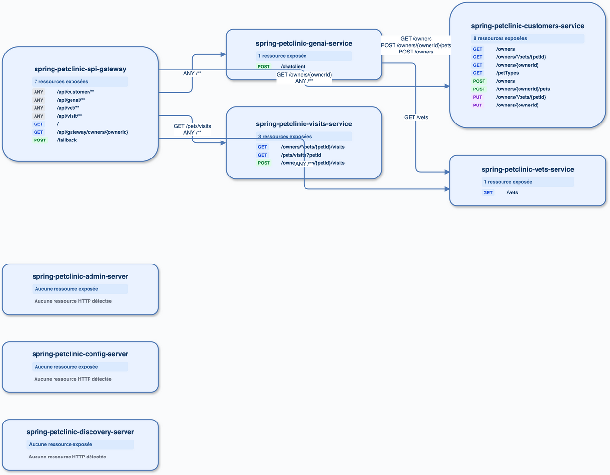

# spring-petclinic-microservices

## Exécution

`cccr index` puis `cccr graph --workspace .` : 8 services, 30 endpoints HTTP et 10 relations HTTP. Aucun endpoint Kafka.

## Analyse directe

Lecture des contrôleurs Spring, des clients `WebClient`/`RestClient` et de `application.yml` Gateway. Les 8 services sont confirmés; les routes Gateway, les appels GenAI vers Customers/Vets et les appels du Gateway vers Customers/Visits sont présents dans le code.

## Diff

| Élément | cccr | Direct | Conclusion |
|---|---|---|---|
| Services | 8 | 8 | conforme |
| HTTP | 30 endpoints, 10 relations | 30 endpoints, 10 relations | conforme |
| Kafka | 0 | 0 | conforme |

Reste à améliorer : les routes Gateway `ANY /**` sont nécessairement plus larges que les routes concrètes ciblées; le diagramme les regroupe pour rester lisible.

## Axes

Voir [BACKLOG.md](../BACKLOG.md), P1 Gateway.
